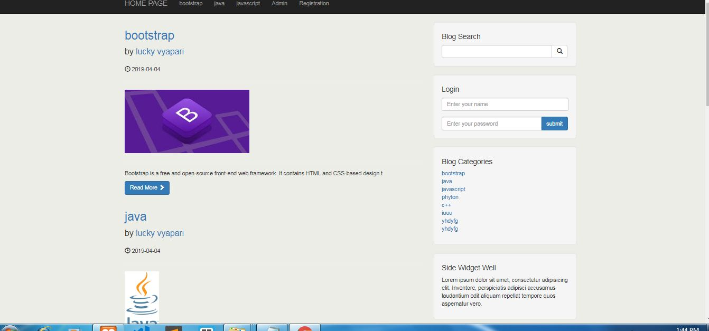
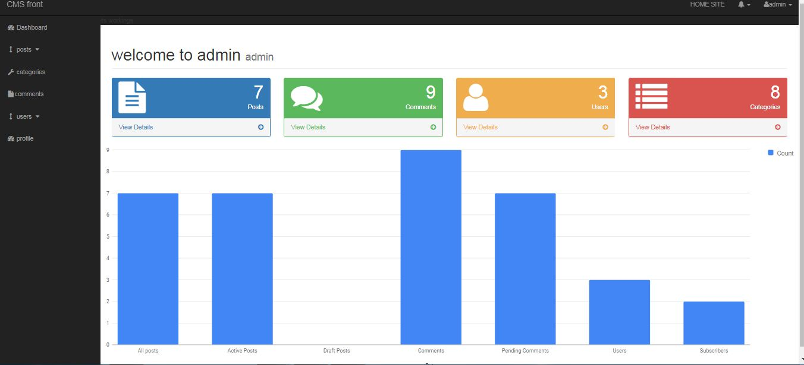
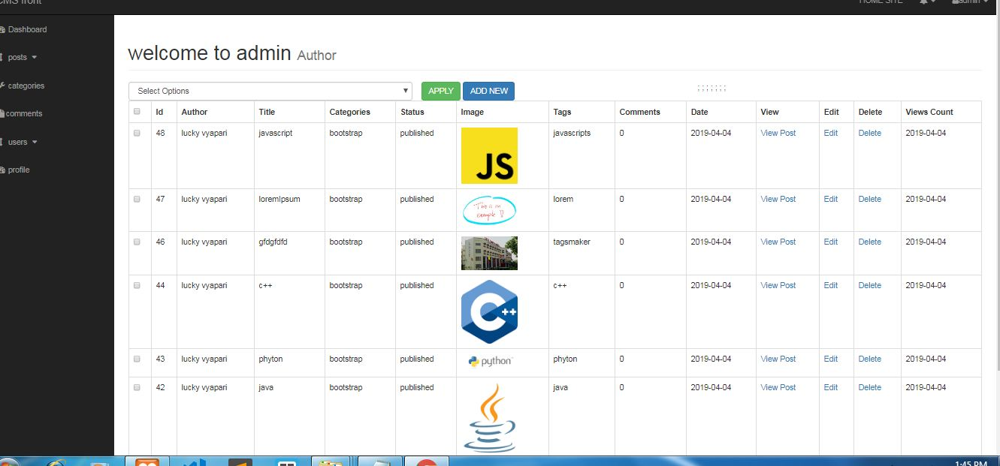
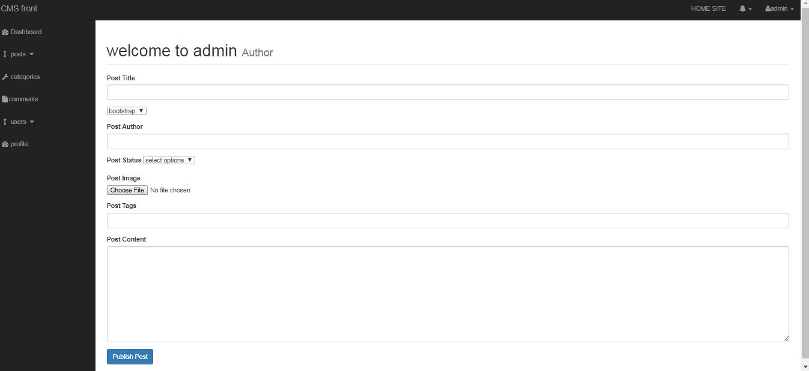
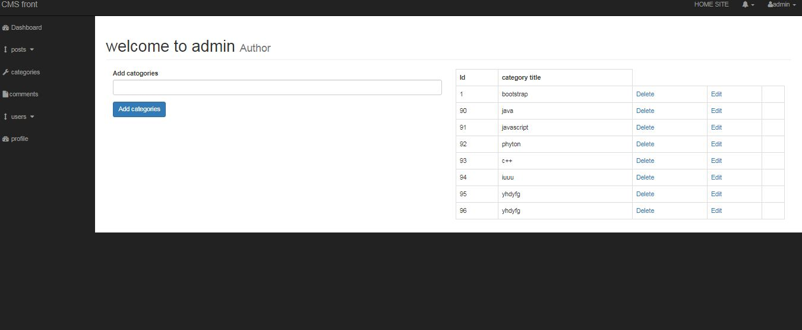
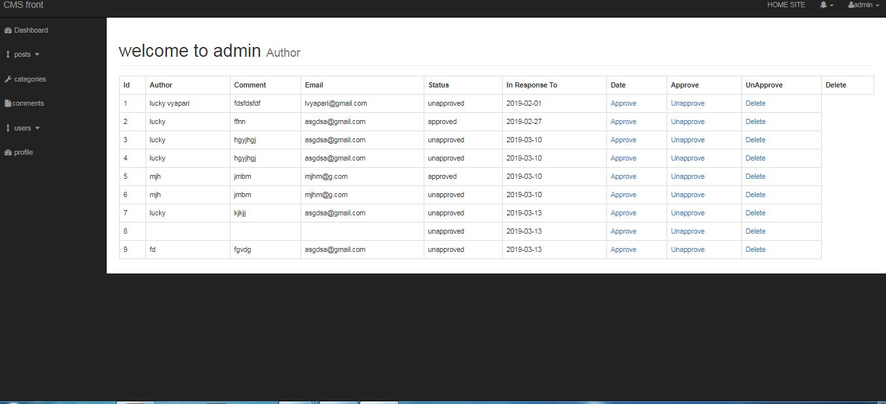
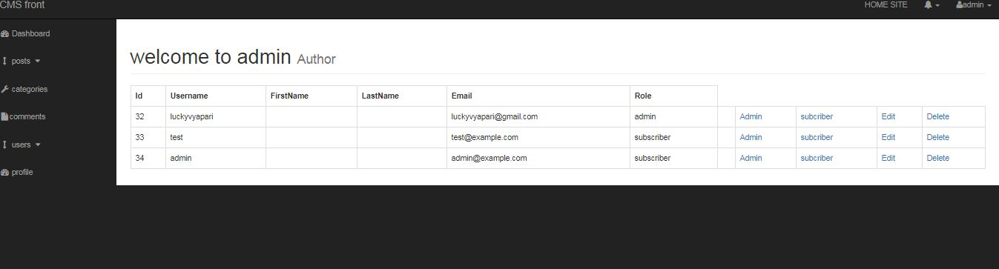
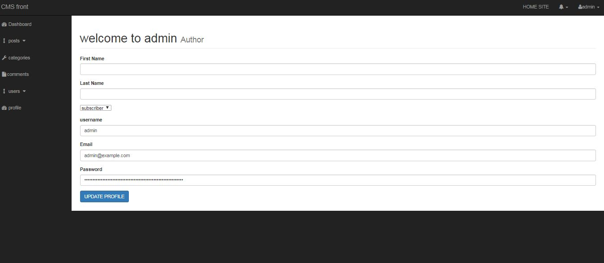
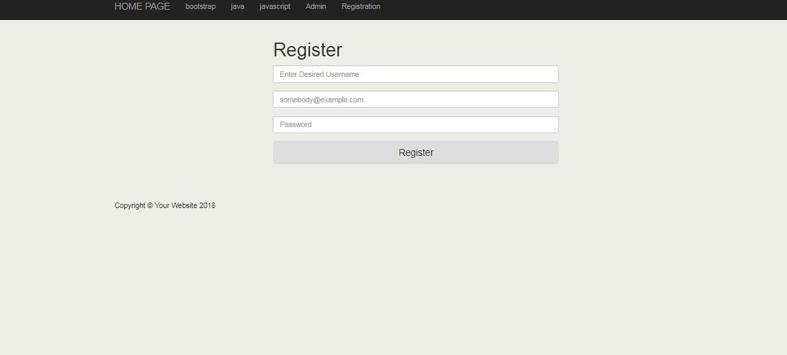

# Project Name
>Content Management System 

## Table of contents
* [General info](#general-info)
* [Screenshots](#screenshots)
* [Technologies](#technologies)
* [Setup](#setup)
* [Features](#features)
* [Status](#status)
* [Inspiration](#inspiration)
* [Contact](#contact)

## General info
This is a : Content Management System like WordPress, Drupal or Joomla Using PHP.

## Screenshots

## Technologies
* Tech 1 - php.
* Tech 2 - bootstrap
* Tech 3 - html.
* Tech 1 - css.
* Tech 2 - javascript.

## Setup

You’ll need XAMP Server or WAMP Server. Put the file inside “c:/wamp/www/” or “c:/xampp/htdocs/”. Go To “localhost/phpmyadmin” in any browser and create Database named “cms”.In That Database, Import cms.sql and finally open go to URL: “http://localhost/file_name/phpfilename”
Don’t Forget To create a database and import sql file to run.

Login Admin      Username : admin
                 Password :  123456

## Features
List of features ready and TODOs for future development
* cms like wordpress

*** Details of admin page***

* ADMIN can see allpost,active post,draft post,comment,spending comments,users subcriber in GRAPHICAL INTERFACE and track from dashboard.

* ADMIN see all posts.
* ADMIN can edit or delete posts.
* ADMIN can make post  publish,draft,clone.
* when admin login can directly go to webpage and edit the post.
* post can be put in categories wise.

* ADMIN add categories.
* ADMIN see all categories.
* ADMIN can edit or modify categories.
* ADMIN can delete categories

* ADMIN see all comments on blog.
* ADMIN can approve or unapprove comments.
* ADMIN can delete comments.

* ADMIN see all users.
* ADMIN can make users admin or subcriber.
* ADMIN can delete or edit user.
* ADMIN can add users.

* ADMIN can edit and modify own profile.

*****ADMIN features****
* ADMIN can add college name and location.
* ADMIN can add co-admin.
* ADMIN can view all co-admins
* ADMIN can add students.
* ADMIN can add college name and location.
* ADMIN can see details of students.
* ADMIN can edit the details of students.
* ADMIN can delete the details of students.

*** Details of front-end***

*  Its responsive web page work on any sceeen like mobile,pc,tablets etc.
* users canlog in too.
* users can comment on post
* users can search on webpage by using search option.
* user can see page according to catrgories.

To-do list:
* many things could be added in features

## Status
Project is:  _finished.

## Inspiration
Project inspired by udemy course, based on Content Management System

## Contact
Created by LUCKY VYAPARI - feel free to contact me!
***It is a zip folder, for see the source code you should download it.***

Thanks from ***LUCKY VYAPARI.***
